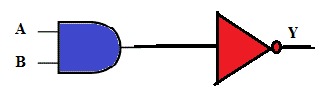
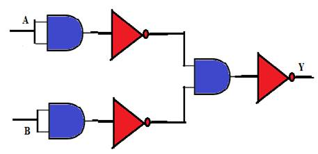
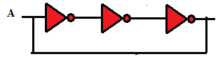
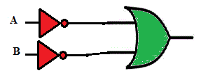
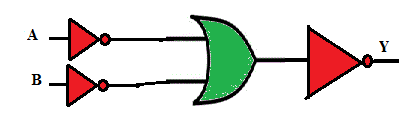

Q1. For the combination shown below, the Boolean expression for Y is:  
  
A  Y = A’. B’  
B  Y = A. B  
**C  Y = (A . B)’**  
D  Y = A + B  

Q2. For the circuit shown below the Boolean expression for the output is expressed as :  
  
**A  Y = A + B**  
B  Y = A . B  
C  Y = (A . B)’  
D  Y = A’ + B’  

Q3. For the circuit shown below, if a momentary Logic 1 is applied to input A, then the output will be:  
    
A  0  
B  1  
**C  Square wave (Toggling)**  
D  None of these  

Q4. The equivalent gate representing the combination shown below is:  
    
A  AND  
B  Bubbled AND  
**C  NAND**  
D  XOR  

Q5. The Boolean expression for output Y is:  
    
A  A’. B’   
B  A’ + B’   
C  A + B  
**D  A.B**  