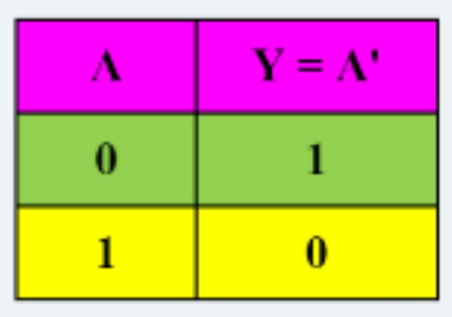
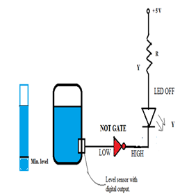
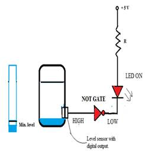

### 1 INTRODUCTION
The NOT gate has only one input and one output. It provides an output that is inverse of the input i.e. it changes a 1 at its input to a 0 at the output and vice-versa. The Boolean expression for NOT is expressed as a bar or a single prime (apostrophe) over the variable. If input A passes through two NOT gates, the result is 'double NOT A', which equals the input A. The NOT operation is called a unary operation since it operates upon only one variable. Conversely, the OR and AND operations are binary operations as two or more variables are involved.
### 1.1 NOT GATE
|Description | Produces a HIGH output if the input is LOW and vice versa. |
|-------|--------------------|
|Symbol|  | 
|Truth Table|  |
### 1.2 APPLICATION: FUEL LEVEL INDICATOR

To indicate whether the fuel level in a tank has reached the minimum (reserve) level, a simple NOT gate along with a digital output level sensor can be used.

### 1.3 CONCEPT:

When the fuel level drops below the reserve/minimum level (1/4 th level of tank), the level- sensor gives output as logic HIGH.  The NOT gate produces a LOW output, and the *RED LED* *glows* to indicate this *fuel shortage* status. To simulate the variation in the fuel level in the tank, a slider is provided.  
       
Figure 1 Concept of Fuel Level Indicator